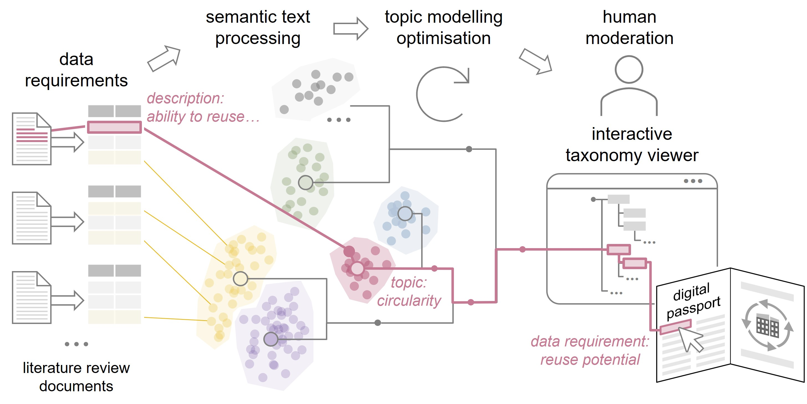

# Computational Taxonomy Development for Digital Passports using Semantic Topic Modelling to Advance Circular Construction



**Silvia Vangelova¹, Kasimir Forth¹, Jakob Beetz², Catherine De Wolf¹**

¹ Chair of Circular Engineering for Architecture, ETH Zurich, Zurich, Switzerland<br>
² Chair of Design Computation, RWTH Aachen University, Aachen, Germany

## Workflow overview

| Step | Description | Code location |
|---|---|---|
| 1. Description generation | A description of each data point is generated by an LLM based on RAG using the source literature. Run for three models: Phi-4-mini-Instruct, Apertus-8B-Instruct, GPT-5-nano | `notebooks/01_*` → `data point descriptions/` |
| 2. Clustering optimisation | BERTopic hyperparameters are optimised with Optuna (multi-objective: DBCV and CCC) for each description source and for the original data-point names. | `notebooks/02_*` → `optuna models/` |
| 3. Topic hierarchy generation | Top trials are visualised as binary-tree topic hierarchies (interactive HTML dendrograms, xlsx and JSON exports). | `generated topic hierarchies/` |
| 4. Expert evaluation & moderation | A Flask-based web interface serves a blind qualitative evaluation of the generated hierarchies. Through a drag-and-drop moderation web interface, annotators rated the generated trees. The expert-moderated result is the final taxonomy. | `taxonomy web interface/`, `annotator results/`, `moderated digital passport taxonomy/` |

Result visualisations live in `notebooks/04_*`; end-to-end timing and compute details are in [documentation/workflow-timing-report.md](documentation/workflow-timing-report.md).

## Repository layout

- [literature review/](literature%20review/) the input: data points and groups extracted from 30 publications on digital/material passports.
- [notebooks/](notebooks/) the workflow notebooks (numbered by stage) with [requirements.txt](notebooks/requirements.txt). Stage 1 notebooks were executed as SLURM GPU jobs; a CPU-only environment for the analysis notebooks is described in [documentation/requirements-analysis.txt](documentation/requirements-analysis.txt).
- [data point descriptions/](data%20point%20descriptions/)  LLM-generated descriptions, one JSON per data point per model. These are the **copyright-filtered** versions: exact retrieval excerpts are kept only for sources whose licenses permit redistribution;. 
- [optuna models/](optuna%20models/) saved BERTopic models for every optimisation trial, per description source.
- [generated topic hierarchies/](generated%20topic%20hierarchies/)  per-trial hierarchy exports (HTML viewers, xlsx, JSON) read by the web interface.
- [taxonomy web interface/](taxonomy%20web%20interface/) the Flask evaluation and moderation app; see its own [README](taxonomy%20web%20interface/README.md) for setup and endpoints.
- [annotator results/](annotator%20results/)  anonymised evaluation ratings and moderation state from the three annotators, plus a [summary notebook](annotator%20results/annotator_results_summary.ipynb).
- [moderated digital passport taxonomy/](moderated%20digital%20passport%20taxonomy/)  the final expert-moderated taxonomy (`moderated_taxonomy.json`) with standalone HTML viewers.

## Repository set-up

**Final taxonomy** open `moderated digital passport taxonomy/moderated_taxonomy_viewer.html` in a browser

**Analysis notebooks** (clustering, visualisation) create environment described in [documentation/requirements-analysis.txt](documentation/requirements-analysis.txt):

```bash
pip install torch --index-url https://download.pytorch.org/whl/cpu
pip install -r documentation/requirements-analysis.txt
```

**Description generation** (stage 1) requires the GPU stack in [notebooks/requirements.txt](notebooks/requirements.txt), the source PDFs (not redistributed here), and for the GPT-5-nano notebook an `OPENAI_API_KEY` environment variable.

**Taxonomy web interface** follow [taxonomy web interface/README.md](taxonomy%20web%20interface/README.md).

## Data and copyright

The source PDFs are not included in this repository. Generated description JSONs cite their sources and embed exact retrieval text only where the source license permits, see [data point descriptions/copyright_summary.md](data%20point%20descriptions/copyright_summary.md).
